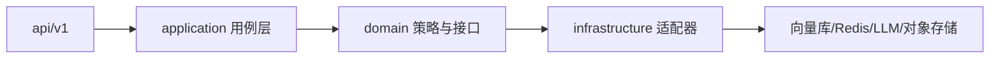

# 企业级 RAG 平台改造计划与进度

> **用途**：按「从简单到复杂」顺序推进架构化、工程化改造；**每完成一步请在本文勾选并更新「进度摘要」「完成记录」**，便于人与 AI 助手持续对齐上下文。  
> **原则**：不重复堆砌「调接口」，以分层边界、可观测、可运维、可协作为准绳。

---

## 1. 元信息（每次推进请更新）

| 项 | 内容 |
|----|------|
| 文档版本 | v1.7 |
| 最近更新日期 | 2026-04-07 |
| **当前进行** | **已全部完成**（E～G 清单与 E-3 实现对齐；后续以业务需求新开条目） |
| 说明 | 完成某步骤后，将「当前进行」改为下一步编号；全部完成后写「已全部完成」或归档结论。 |

---

## 2. 进度摘要（一眼查看）

| 阶段 | 说明 | 进度 |
|------|------|------|
| **A** | 盘点与低风险收敛（文档、脚本、配置、调用链梳理） | 4 / 4 |
| **B** | 后端分层与单一问答契约（`application` / `domain` 雏形） | 4 / 4 |
| **C** | 检索领域化、插件化与测试门禁 | 4 / 4 |
| **D** | 稳定性与可观测（超时、降级、指标、追踪）体系化 | 4 / 4 |
| **E** | 权限、多租户、审计与数据隔离加固 | 3 / 3 |
| **F** | Agent 编排边界、跨会话记忆产品化 | 3 / 3 |
| **G** | 集群化、发布与治理叙事（部署、告警、SLA） | 3 / 3 |

**总进度**：25 / 25 步（见第 5 节清单）。

> 完成任一步骤后，更新上表分子与「步骤清单」中的勾选，并在第 4 节追加一行完成记录。

---

## 3. 目标架构参考（不变更则无需改）

**目标目录演进（与现有 `backend/app` 共存迁移，非一次性推翻）**：

- `application/`：用例编排（Chat、入库、评测、Agent 运行）
- `domain/`：领域模型与端口（`Protocol`）、检索策略
- `infrastructure/`：Milvus/Qdrant、Redis、MinIO、LLM SDK 等实现
- 现有 `services/`：逐步迁入上列层次，最终删除或仅作兼容薄封装

---

## 4. 完成记录（每完成一步追加一行）

| 日期 | 步骤编号 | 摘要（1～3 句，可含 PR/分支名） |
|------|----------|--------------------------------|
| 2026-04-07 | A-1 | 新增本文档；在 `docs/00-项目全景与文档索引.md` 文档地图中增加入口行。 |
| 2026-04-07 | A-2 | 新增 `docs/scripts与根目录清单.md`：根目录、`scripts/` 与 `backend/scripts/`（SQL 迁移）区分及归属建议。 |
| 2026-04-07 | A-3 | 新增 `docs/问答调用链.md`：Mermaid 调用链，标注 `USE_ADVANCED_RAG` / `USE_LANGCHAIN` 分支。 |
| 2026-04-07 | A-4 | 扩充根目录 `.env.example`：RAG/LangChain/限流等可选变量，并注明以 `config.py` 为准。 |
| 2026-04-07 | B-1 | 新建 `backend/app/application`、`domain`、`infrastructure` 包及 README（依赖方向说明）。 |
| 2026-04-07 | B-2 | 新增 `backend/app/schemas/chat_contract.py`：`RetrievalProfile`、`ChatTurnContext`、`ChatTurnResult` 及装配函数。 |
| 2026-04-07 | B-3 | 新增 `backend/app/application/chat_facade.py`：`ChatFacade` 委托 `ChatService`，行为不变。 |
| 2026-04-07 | B-4 | `api/v1/chat.py` 改为通过 `ChatFacade`；支持请求头 `X-Trace-Id` / `X-Request-ID` 传入 `trace_id` 写调试日志。 |
| 2026-04-07 | C-1 | 新增 `backend/app/domain/rag/ports.py`：`VectorStore`、`FulltextIndex`、`Reranker`、`RetrievalPipeline` Protocol；暂不接线实现。 |
| 2026-04-07 | C-2 | 新增 `infrastructure/rag/hybrid_retrieval_pipeline.py`（`HybridRetrievalPipeline`：单库/多库混合检索 + RRF + Rerank）；`progress.py` 抽取 `_rag_progress_call`；`ChatService._rag_context` / `_rag_context_kb_ids` 委托管线，行为不变。 |
| 2026-04-07 | C-3 | 新增 `backend/tests/test_hybrid_ops.py`：`rrf_score` 单元测试；`infrastructure/rag/__init__.py` 仅导出轻量 `rrf_score`，避免测试导入拉起重依赖。 |
| 2026-04-07 | C-4 | 新增 `docs/评测数据集版本约定.md`；索引已链入 `00-项目全景与文档索引.md`。 |
| 2026-04-07 | D-1 | `config.py` 增加 LLM/Embedding/Rerank/向量/Redis 超时与 `LLM_HTTP_MAX_RETRIES`、`EMBEDDING_HTTP_RETRIES`；`llm_service` 使用 `httpx.Timeout`；`embedding_service` 网络错误重试；`cache`/`rate_limit` Redis 超时读配置；`vector_store` Milvus/Qdrant 客户端 `timeout`。 |
| 2026-04-07 | D-2 | `core/request_context.py` + `main` 中间件注入 `X-Trace-Id`；`ChatFacade.chat` 打 `duration_ms` 与 `trace_id` 的 `info` 日志。 |
| 2026-04-07 | D-3 | 新增 `docs/降级路径说明.md`（Redis/RAG/Rerank/Embedding 等行为与日志索引）。 |
| 2026-04-07 | D-4 | `core/ops_metrics.py` + `GET /api/v1/ops/snapshot`；Embedding transport 重试计数。 |
| 2026-04-07 | E-1 | 新增 `docs/资源模型与多租户缺口.md`：用户-知识库现状与租户表/向量隔离演进缺口。 |
| 2026-04-07 | E-2 | `knowledge_access.sanitize_kb_scope_for_user` 在 chat / 流式 / RAG 评测入口统一过滤 KB；`retrieve_ordered_chunk_ids` 支持按 `user_id` 校验；`tests/test_knowledge_access.py` 覆盖 `unique_positive_kb_ids` 离线单测。入库路径仍以各 API 既有 `kb_id` 归属为准，向量 metadata 规范见 E-1 缺口文档。 |
| 2026-04-07 | E-3 | `audit_logs` 增加 `trace_id`（脚本 `add_audit_trace_id.sql`）；`log_audit` / 列表 API 与 `AuditLogItem` 对齐；`core/audit_text.summarize_text_for_audit` 脱敏摘要；可选 `AUDIT_LOG_CHAT_COMPLETION` 记录问答完成（默认关）；删除会话与文件/知识库审计写入 `trace_id`。 |
| 2026-04-07 | F-1～G-3 | 新增 [`企业级演进-F与G-备忘.md`](./企业级演进-F与G-备忘.md)：RAG 与 Agent 边界、`memory_service` 过期/容量/权限设计、编排器方向、Compose/无状态 API/健康探针、告警与 SLA 建议、安全加固清单。 |

**可选：关键决策备忘**（避免后续争议，有则补充）

- **门面与追踪**：`trace_id` 已由中间件写入上下文并在门面打关键耗时；全量 JSON 结构化日志 / OpenTelemetry 可后续再接。
- **C-2**：`domain/rag/ports.RetrievalPipeline` 与当前 `HybridRetrievalPipeline` 方法名未强行统一，后续可增适配器或改名对齐；全库/渐进检索仍在 `ChatService`，未并入本类以免单次 PR 过大。
- **D-4**：进程内计数为演示与排障起点；生产可换 Prometheus，前端「RAG 六大指标」仍为效果评测主入口。
- **E-2**：完整 `sanitize` 依赖 DB；单测仅覆盖无 ORM 的 `unique_positive_kb_ids`，避免无 `asyncmy` 环境 import 失败；越权场景建议在有依赖栈的环境做接口回归。
- **E-3**：新增列需执行 `backend/scripts/add_audit_trace_id.sql`；`AUDIT_LOG_CHAT_COMPLETION` 默认 `false`，避免高频问答撑爆审计表。

---

## 5. 步骤清单（从简单到复杂，完成请打勾）

> 约定：`- [ ]` 未开始，`- [x]` 已完成。进行中可在标题旁标注 `🔄`。

### 阶段 A：盘点与低风险收敛

- [x] **A-1** 确认本文件纳入 `docs/00-项目全景与文档索引.md` 文档地图，团队知悉入口。
- [x] **A-2** 梳理根目录与 `scripts/`：列出保留 / 迁入 `backend/scripts` / 废弃清单，**不删代码仅出清单**亦可先完成本项。
- [x] **A-3** 绘制或更新「当前问答调用链」简图（从 `chat` API → 检索 → LLM），标注重复路径（如 LangChain / 自研 / LlamaIndex 并存）。
- [x] **A-4** 统一环境配置清单：核对 `.env.example` 与 `core/config.py`，缺失项补文档说明（仍属文档级，不改行为）。

### 阶段 B：后端分层与单一契约

- [x] **B-1** 新建 `application/`、`domain/`、`infrastructure/` 包（`__init__.py`），**仅占位与 README 说明依赖方向**。
- [x] **B-2** 定义「一次问答」输入输出契约（Pydantic 或 TypedDict）：`trace_id`、`kb_ids`、检索配置、返回 `answer` + `citations` + 可选 `debug`。
- [x] **B-3** 实现薄门面 `ChatFacade`（或等价命名），由现有 `chat_service` **委托**调用，行为不变，仅集中入口。
- [x] **B-4** 将 `chat` 相关路由改为只调门面，**单测或手动回归**流式与非流式路径。

### 阶段 C：检索领域化与质量门禁

- [x] **C-1** 在 `domain/rag` 定义检索端口：`VectorStore`、`FulltextIndex`、`Reranker`、`RetrievalPipeline` 接口。
- [x] **C-2** 将现有混合检索 + RRF + Rerank 逻辑迁入 pipeline 实现类，**原 API 不变**。
- [x] **C-3** 为核心检索步骤补充单元测试（mock 外部服务）或 golden query 集成测试。
- [x] **C-4** 与现有 `recall_evaluation_service` / benchmark 对齐：**数据集版本号**字段或文档约定（即使先只做文档）。

### 阶段 D：稳定性与可观测

- [x] **D-1** 对外部调用（向量、LLM、Redis）统一 **超时** 与可配置重试策略（幂等安全处）。
- [x] **D-2** 结构化日志：请求级 `trace_id` 贯穿；关键阶段打 `duration_ms`。
- [x] **D-3** 与现有 `rate_limit`、`cache_service` 对齐：**降级路径**（如检索失败 → 全文或仅 LLM）行为与日志可查询。
- [x] **D-4** 指标：`rag_metrics` 或 Prometheus 友好计数（错误率、P95、检索空结果率），至少一种可演示。

### 阶段 E：权限、租户与审计

- [x] **E-1** 梳理资源模型：用户 → 租户/项目 → 知识库 → 文档；与现表结构对照，缺口列表。
- [x] **E-2** 检索与入库路径强制 `kb_id` / 租户过滤（向量 metadata 或 collection 命名规范），**集成测试**覆盖越权场景。
- [x] **E-3** 审计字段：关键操作记录操作者、资源 ID、摘要（查询可脱敏）；与现有审计模块对齐或补表。

### 阶段 F：Agent 与记忆

- [x] **F-1** 文档化 **RAG 作为 Tool** 与「纯 Agent 对话」边界；对外 API 分层（避免一个端点承担一切）。
- [x] **F-2** 跨会话记忆：与 `memory_service` 对齐 **过期、容量、权限** 策略（先设计后实现）。
- [x] **F-3**（可选）编排器原型：多步任务状态机 + 失败重试，与 Skills/MCP 调用链一致。

### 阶段 G：集群与治理叙事

- [x] **G-1** 部署文档与 `docker-compose` / K8s 片段对照：**无状态 API 多副本**、健康探针、滚动更新说明。
- [x] **G-2** 告警与 SLA：与监控栈对接（或云监控），定义核心告警规则（延迟、错误率、向量不可用）。
- [x] **G-3** 安全加固清单：密钥轮换、上传扫描、敏感信息脱敏（按优先级逐项勾选）。

---

## 6. AI / 协作者使用说明

1. **开改前**：读本文「进度摘要」「当前进行」「步骤清单」未勾选项。  
2. **改完后**：勾选对应 `- [x]`，更新「元信息」日期与「当前进行」，在「完成记录」表追加一行。  
3. **若实现与计划有偏差**：在「关键决策备忘」记 1～2 句原因与折中。  
4. **不必同步修改** `README` 全文；仅当对外行为变化时，再改 `API接口文档` 或 `README` 相关小节。

---

## 7. 与基线能力的关系

以下能力在 **README / 现行代码** 中多已存在，**本计划不重复实现**，以「收敛、分层、可验证」为主：

- FastAPI、混合检索、Rerank、流式、评测、Redis、限流、认证、审计等。

若某步骤仅为「把已有逻辑搬到新分层」，请在完成记录里写明「行为不变，仅搬迁」。
