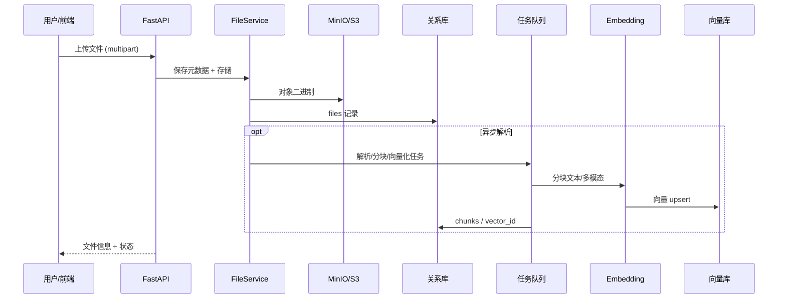
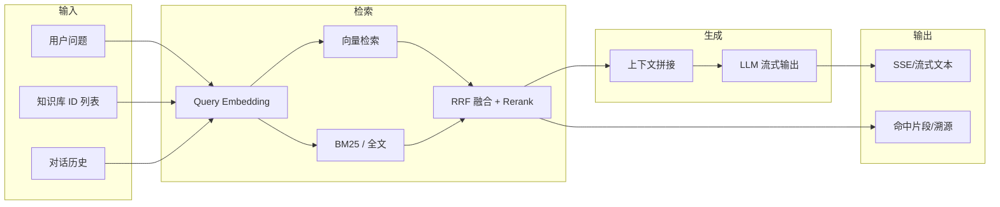
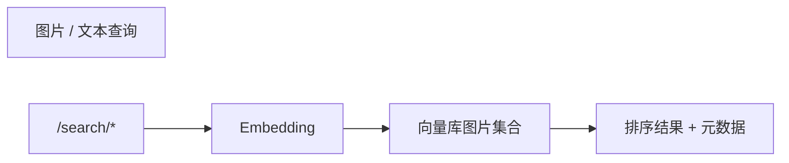
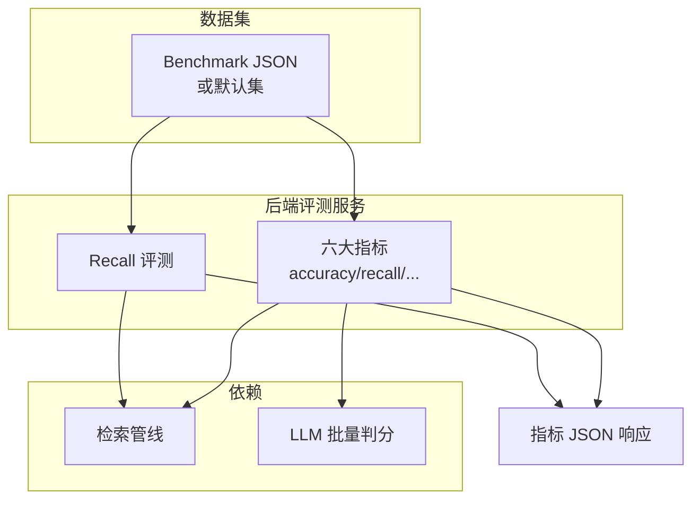
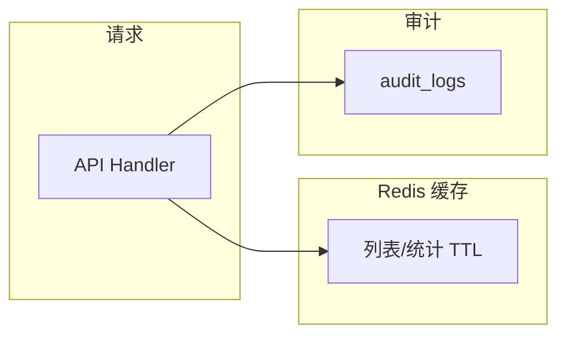

# 数据流向图

描述主链路中的 **数据如何流动**；实现细节见 `backend/app/services/` 下各服务。

## 1. 文件入库与索引

## 2. RAG 问答（流式）

可选分支（由配置与请求参数决定）：

- **Advanced RAG**：多查询改写后再检索。
- **联网检索**：工具/搜索服务结果注入上下文。
- **工具/MCP**：LLM 或编排层调用外部工具后再回答。

## 3. 非流式补全

与流式相同，仅在 `ChatService` 出口处 **一次性返回** 完整文本，无 SSE 分块。

## 4. 多模态检索（图片）

## 5. 召回与 RAG 指标评测

## 6. 浏览器助手 / 电脑管家（概念流）

## 7. 缓存与审计（横切）

