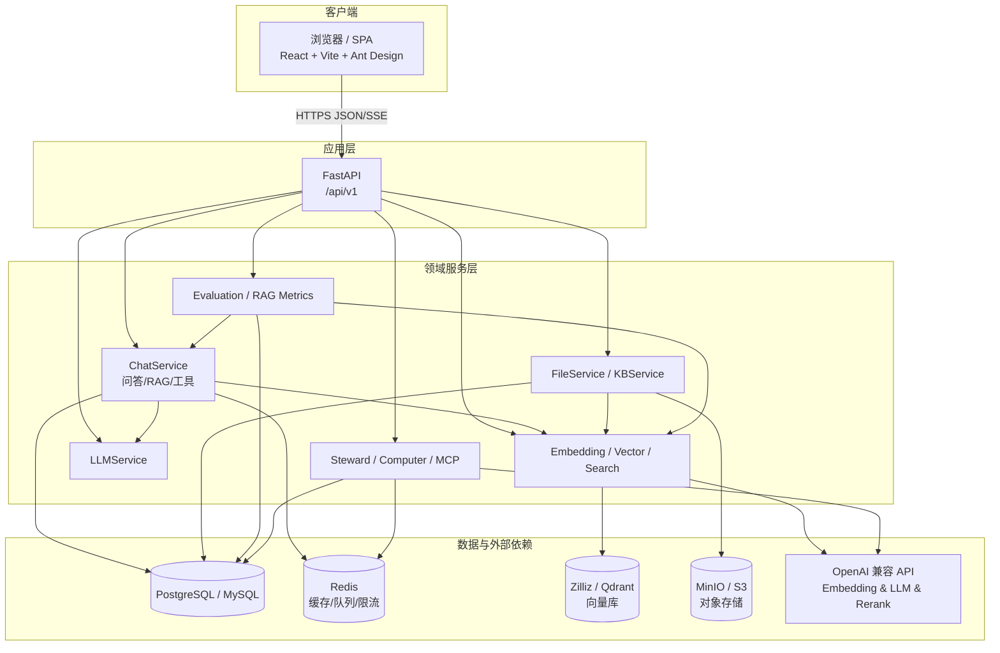
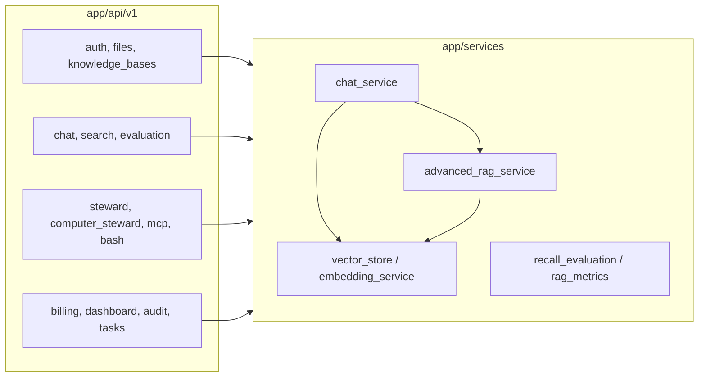

# 架构设计图

以下示意图使用 **Mermaid**，可在 GitHub、GitLab、Typora、VS Code 等环境渲染。描述与当前仓库 **单体后端 + SPA 前端** 实现一致；微服务仅为可选演进方向。

## 1. 逻辑分层（C4 容器级简化）

## 2. 后端模块关系（简化）

## 3. 与历史文档对照

- 文字版分层与模块说明见 [03-系统架构设计.md](./03-系统架构设计.md)。
- 数据如何在各层之间流动见 [数据流向图.md](./数据流向图.md)。
