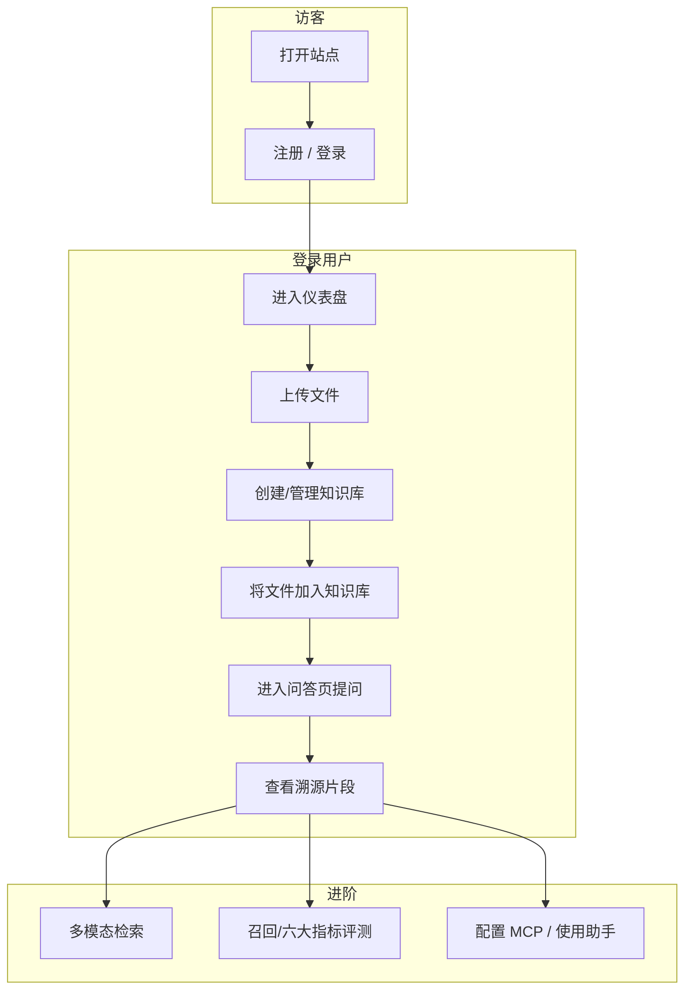

# 用户操作与页面流程

基于 `frontend/src/App.tsx` 路由与业务逻辑（登录态由 `useAuthStore` 控制）。

## 1. 前端路由与页面

| 路径 | 页面 | 说明 |
|------|------|------|
| `/login` | Login | 登录 |
| `/register` | Register | 注册 |
| `/` | Dashboard | 仪表盘（需登录） |
| `/files` | Files | 文件管理 |
| `/knowledge-bases` | KnowledgeBases | 知识库 |
| `/chat` | Chat | 智能问答 |
| `/billing` | Billing | 计费与套餐 |
| `/profile` | Profile | 个人资料 |
| `/image-search` | ImageSearch | 多模态检索 |
| `/recall-evaluation` | RecallEvaluation | 召回评测 |
| `/advanced-rag-metrics` | AdvancedRAGMetrics | RAG 六大指标 |
| `/audit-log` | AuditLog | 审计日志 |
| `/mcp-servers` | McpServers | MCP 配置 |
| `/steward` | Steward | 浏览器助手 |
| `/computer-steward` | ComputerSteward | 电脑管家 |

未登录访问上述受保护路由会 **重定向到 `/login`**。

## 2. 典型用户旅程（泳道图）

## 3. 核心操作说明（产品视角）

1. **首次使用**：注册账号 → 登录 → 在「文件」或「知识库」中上传文档。
2. **构建知识库**：在知识库中创建库 → 添加已上传文件 → 等待解析与索引完成（异步任务可查看任务状态）。
3. **问答**：在「问答」里选择知识库 → 输入问题 → 查看流式回答与引用片段。
4. **效果评估**：在「召回评测」或「RAG 六大指标」中选用 benchmark 或默认集运行评测，对比策略变更。
5. **扩展能力**：在「MCP」中接入服务器；在「浏览器助手」「电脑管家」中提交任务（后者需合适运行环境）。

## 4. 与 API 的对应关系

- 页面操作最终调用 **`/api/v1`** 下各接口，详见 [API接口文档.md](./API接口文档.md)。
- 流式问答使用 **`POST /api/v1/chat/completions/stream`**（前端以 Axios/fetch 消费流）。

## 5. 操作注意

- **大文件/批量上传**：受后端限流与大小限制，失败时查看提示与审计/日志。
- **助手类功能**：浏览器助手需 Playwright 环境；电脑管家需桌面与权限，不适合无头服务器默认开启。
