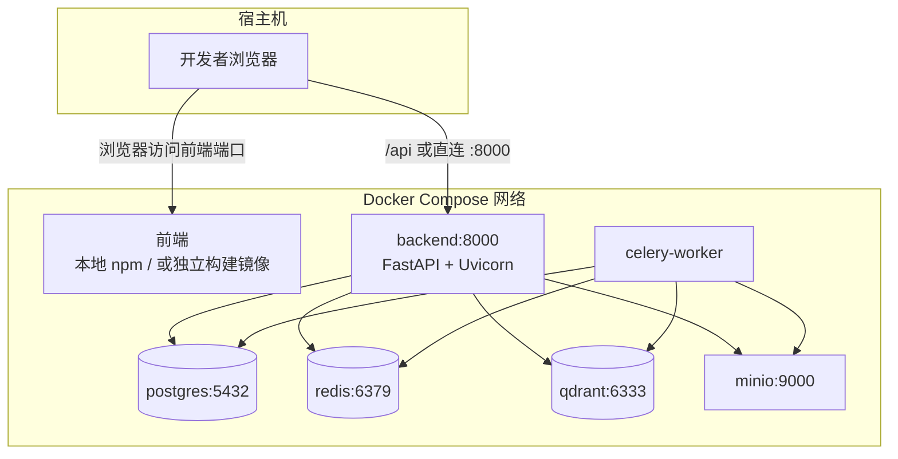
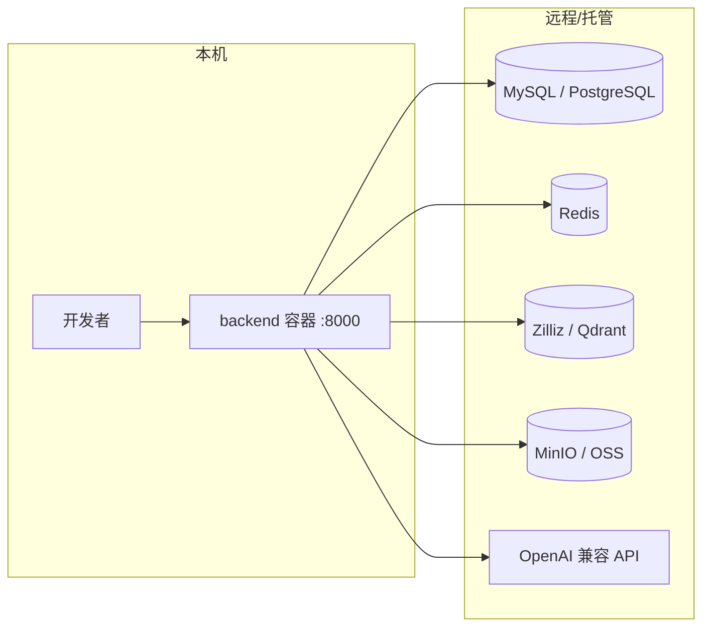
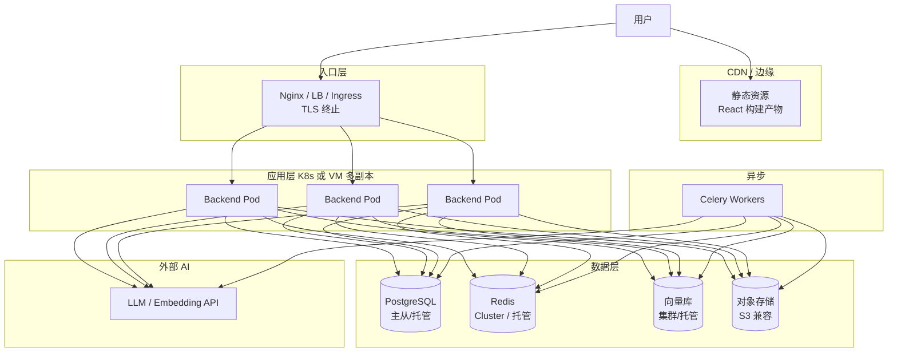

# 部署架构图

与仓库内 **`docker-compose.yml`**（全栈本地依赖）、**`docker-compose.local.yml`**（仅后端，DB/Redis/向量/MinIO 走远程 `.env`）一致。文字版步骤见 [05-部署方案.md](./05-部署方案.md)。

## 1. 开发/测试：Docker Compose（全依赖）

对应根目录 `docker-compose.yml`：在同一 Docker 网络内启动 PostgreSQL、Redis、Qdrant、MinIO、Backend（Uvicorn）、Celery Worker。

说明：

- 当前 `docker-compose.yml` **未包含 frontend 服务**，前端多在宿主机 `npm run dev`，通过 Vite 代理访问后端。
- Celery 依赖 `CELERY_BROKER_URL`（默认 Redis DB 1）。

## 2. 本地：仅容器化后端（远程中间件）

`docker-compose.local.yml` 将 `DATABASE_URL`、`REDIS_URL`、`QDRANT_URL`、`MINIO_*` 等从 `.env` 注入，适合 **云数据库/托管向量库/对象存储**。

## 3. 生产环境（推荐拓扑）

与 [05-部署方案.md](./05-部署方案.md) 中「生产环境部署」一致：入口 **Nginx / Ingress**，前端静态资源 CDN，后端多副本，**有状态组件** 集群化或托管。

## 4. 端口与网络清单（常见）

| 组件 | 默认端口 | 备注 |
|------|----------|------|
| Backend | 8000 | 对外 API 与 `/docs` |
| PostgreSQL | 5432 | 仅内网 |
| Redis | 6379 | 仅内网 |
| Qdrant | 6333 / 6334 | HTTP / gRPC |
| MinIO | 9000 API / 9001 控制台 | 生产建议走 HTTPS 与策略 |

## 5. 配置与密钥

- 生产环境 **勿使用** compose 或 `config.py` 中的默认 `SECRET_KEY` / `JWT_SECRET_KEY`。
- 敏感信息使用环境变量、K8s Secret 或云厂商密钥管理。
