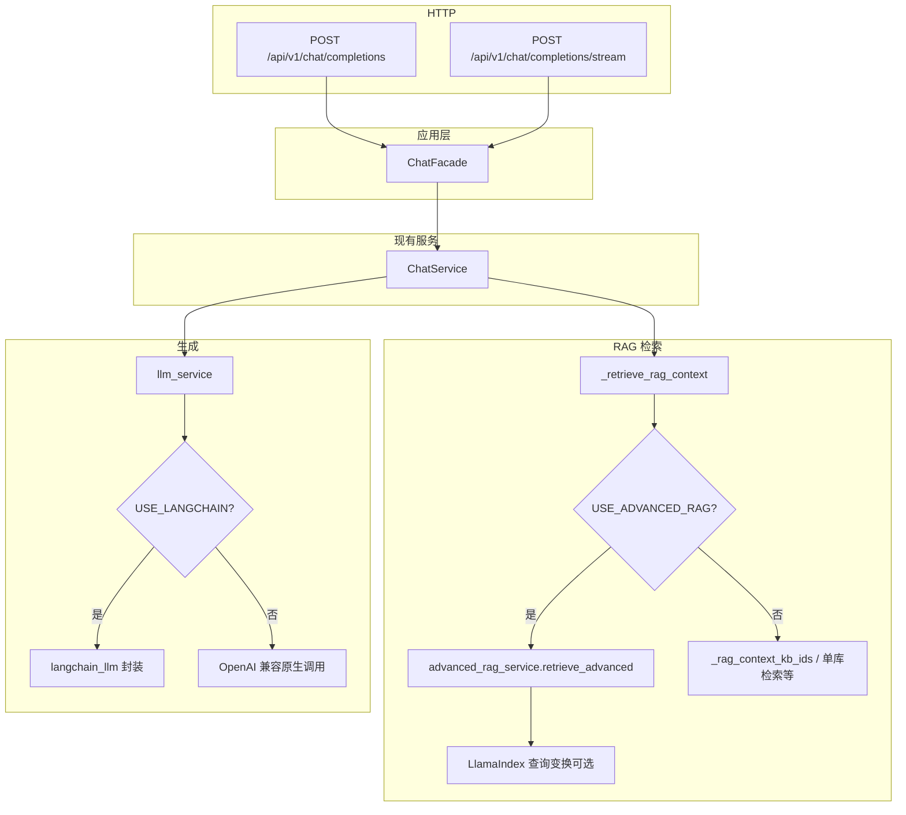

# 智能问答调用链（改造 A-3）

> 描述从 HTTP 到检索与 LLM 的主路径，以及 **Advanced RAG / LangChain** 与主路径的关系，便于重构时收敛重复逻辑。

## 1. 总览（Mermaid）

## 2. 路径说明

**实现位置**：普通单库/多库混合检索（向量 + 全文 RRF + Rerank）已收敛至 `backend/app/infrastructure/rag/hybrid_retrieval_pipeline.py` 中的 `HybridRetrievalPipeline`，由 `ChatService._rag_context` / `_rag_context_kb_ids` 委托调用。

| 分支 | 触发条件 | 说明 |
|------|----------|------|
| **Advanced RAG** | `USE_ADVANCED_RAG=True` | `retrieve_advanced`：LlamaIndex 侧查询变换（可选）+ 复用混合检索与上下文拼装；生成阶段见 `advanced_rag_service` 内对 `USE_LANGCHAIN` 的分支。 |
| **普通多库/单库 RAG** | `USE_ADVANCED_RAG=False` | `_rag_context_kb_ids`、单库向量+BM25+RRF+Rerank 等在 `ChatService` 内。 |
| **LangChain LLM** | `USE_LANGCHAIN=True` | `llm_service` 在导入时用 `langchain_llm` 替换实现，对业务代码透明。 |
| **超能模式** | `super_mode=True` | RAG → MCP → Skills 等顺序编排，仍在 `ChatService`（含流式 `chat_stream`）。 |

## 3. 重复与收敛建议（后续阶段）

- **检索**：将 `_retrieve_rag_context` 中 Advanced / 普通路径统一为 `RetrievalPipeline`（计划 C-1/C-2）。
- **生成**：保持 `llm_service` 为唯一出口，避免在路由层直接依赖 LangChain。

## 4. 变更记录

| 日期 | 说明 |
|------|------|
| 2026-04-07 | 初版：基于 `api/v1/chat.py` → `ChatService` → `_retrieve_rag_context` / `llm_service` |
| 2026-04-07 | 单库/多库混合检索与 RRF+Rerank 已迁入 `infrastructure/rag/hybrid_retrieval_pipeline.py`；`ChatService._rag_context` / `_rag_context_kb_ids` 委托该类。 |
